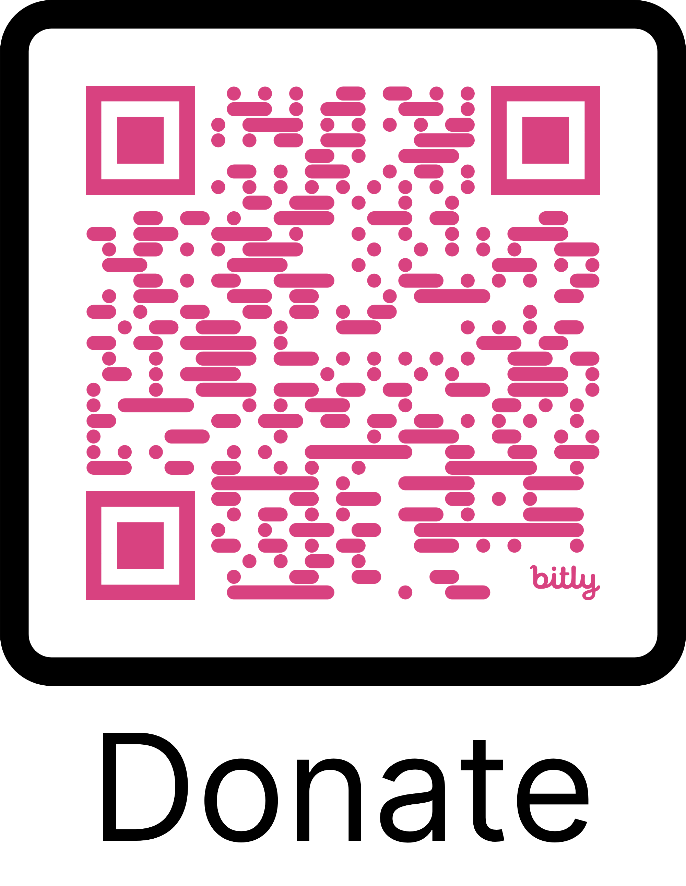
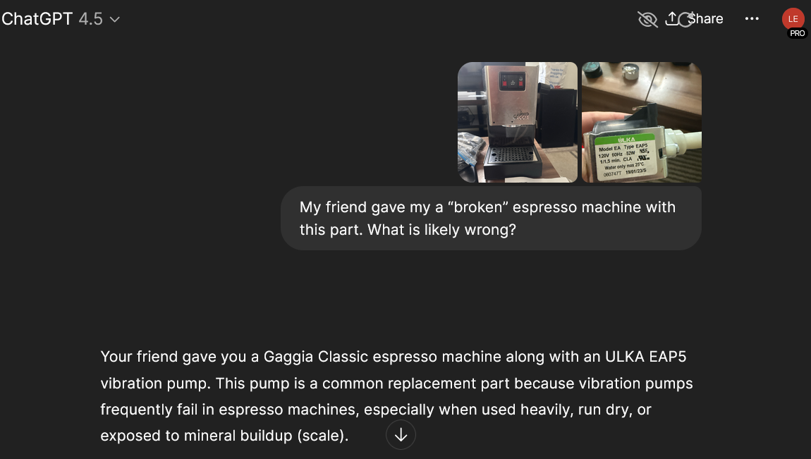
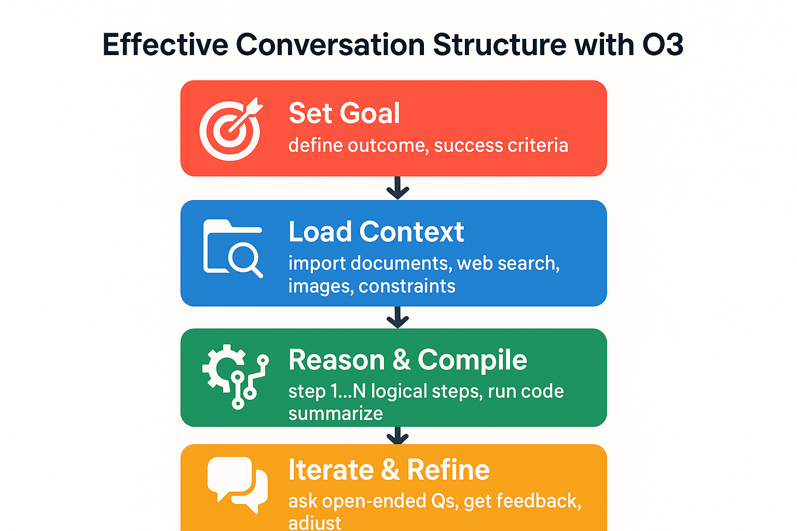
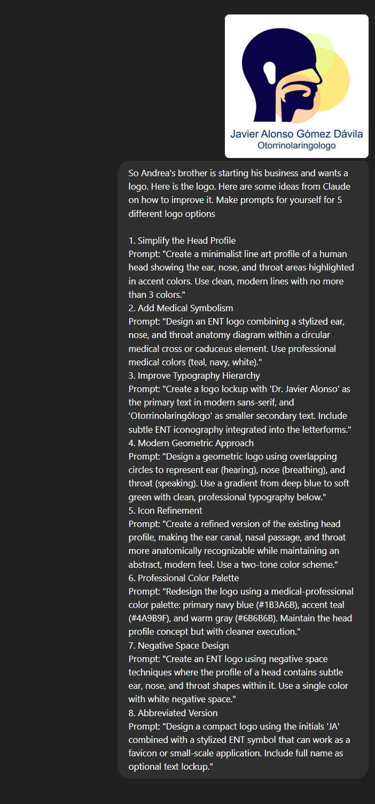
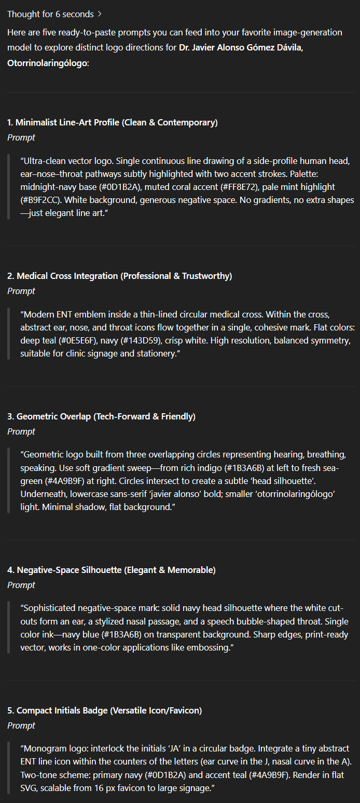

# AI in Action: A 60-Minute Workshop on ChatGPT

**David Leather**
**July 3, 2025**




---

## Welcome & Goals

### **Workshop Goal:**
Leave knowing **when, why, and how** to apply modern AI tools like ChatGPT effectively.

### **Quick Poll:**
**"Have you used ChatGPT before? What for?"**
1. Never
2. Tried it once or twice
3. For fun/creative tasks
4. For work/school tasks

---

## Today's Agenda

| Time  | Topic                                         |
| :---- | :-------------------------------------------- |
| 5 Mins| **LLM 101:** From Autocomplete to Reasoning |
| 10 Mins| **How You Interact:** Text, Voice, & Vision   |
| 10 Mins| **Prompting:** In-Context vs. Open-Ended      |
| 5 Mins | **The AI Landscape:** A Model Comparison      |
| 15 Mins| **Live Demos:** Elections, Travel & Fundraising |
| 10 Mins| **The Big Picture:** Ethics & Sustainability  |
| 5 Mins | **Your Top Uses & Q&A** |

---

## LLM 101: What is an LLM?

* **A Simple Analogy:** It starts as "autocomplete on steroids," trained on a vast amount of internet text to predict the next word.

* **The Magic Leap:** Through massive scale and refinement, it develops emergent abilities like reasoning, summarizing, and translating.

* **Pre-training vs. In-context Learning:**
    * **Pre-training:** The one-time, massive training process that gives the model its general knowledge.
    * **In-context Learning:** The "live" learning you do in the chat window by giving it information, examples, and instructions. This is key to getting good results.

---

## How You Interact with an LLM

It's more than just a chat box.

### **Text Chat**
The classic interface. Ideal for drafting, coding, and detailed queries.

### **Voice Mode**
Real-time, conversational interaction.

### **Vision (Seeing the World)**
Upload images, screenshots, or documents.

---



---

## Prompting: In-Context vs. Open-Ended


### **Open-Ended Prompting** (ChatGPT 4o)
* **What it is:** Broad, exploratory questions.
* **When to use it:** Brainstorming, creative ideation, getting a first draft.
* **Example:** `"Give me some ideas for a fundraising campaign."`

### **In-Context ("Few-Shot") Prompting** (ChatGPT O3)
* **What it is:** Providing specific examples, data, or formats within your prompt. You "show, don't just tell."
* **When to use it:** When you need precision, specific formatting, a certain tone, or up to date information.
* **Example:**
    * `"Here are two of our past successful fundraising emails. Write a new one for our summer campaign targeting Gen Z, using a similar friendly but urgent tone."`
    * `We will be writing and ad campaign to target Gen Zers on X issue. First, search the internet for current trends amongst Gen Zers.`
  

> **Key Takeaway:** Use open-ended prompts to explore the possibility space. Use in-context prompts to get precise, high-quality results.
---

---

## The AI Landscape: 2025 Model Grid

This is a reference slide. The market changes monthly, but here's where things stand today.
| Capability          | **ChatGPT (GPT-O3)** | **Claude 4 (Opus)** | **Gemini 2.5 Pro** |
| :------------------ | :------------------- | :------------------ | :---------------------- |
| **Leaderboard (LMSYS)** | #2 Overall           | #5 Overall          | **#1 Overall** |
| **Reasoning & Logic** | ★★★★★ (Excellent)  | ★★★★★ (Strong)    | ★★★★★ (Top Performer)   |
| **Context Window** | 128k Tokens          | 200k Tokens         | **1 Million Tokens** |
| **Image Generation** | ✅ DALL-E 3          | ❌ No                | ✅ Imagen 3 (Preview)     |
| **Video Generation** | ✅ Sora (Preview)      | ❌ No                | ✅ Veo 2 (Preview)        |
| **Real-time Voice** | ✅ Yes               | ❌ No                | ✅ Gemini Live          |
| **Podcast Support** | ❌ 3rd Party         | ❌ 3rd Party        | ✅ **Native via NotebookLM** |
| **Memory**          | ✅ Past Conversation | ❌ No               | ✅ Google Account Search History
| **Pricing (Pro Tier)**| ~$20/month           | ~$20/month          | ~$20/month              |

---

## Deep Dive 1: Election Endorsements

* **The Goal:** Quickly synthesize endorsements for a proposition from multiple, biased sources.
* **The Method (Vision + Reasoning):**
    1.  Take screenshots of endorsement sections from 3 different news outlets.
    2.  Upload all three images to ChatGPT or Gemini.
* **The Prompt:**
    ```
    "Using only the information in these three images, create a neutral summary of the arguments for and against Proposition 42. Then, create a table with three columns: Organization, Stance (For/Against), and Key Reason Cited."
    ```
* **Why it works:** It forces the AI to stick to the provided context, reducing hallucination and revealing the core arguments from each source.

---

## Deep Dive 2: Travel Planning

* **The Goal:** Turn a pile of booking confirmations into a coherent daily itinerary.
* **The Method (Long Context + Vision):**
    1.  Save your flight, hotel, and car rental confirmation emails as PDFs.
    2.  Upload them all at once into Gemini (leveraging its 1M token context window).
* **The Prompt:**
    ```
    "From these booking confirmations, create a daily itinerary for my trip to Tokyo. Include travel times between the airport and hotel. For each day, suggest two dinner spots near my hotel, one casual and one upscale. Format the output as a simple schedule."
    ```
* **Why it works:** The large context window means you don't have to feed it information piece by piece. It can see the whole trip at once.

---

## Deep Dive 3: Fundraising Help

* **The Goal:** Generate tailored fundraising asks for different donor personas.
* **The Method (In-Context Prompting + Persona Role-Play):**
    1.  Provide a short mission statement for your non-profit.
* **The Prompt:**
    ```
    "You are a professional fundraising copywriter. Our non-profit's mission is [Insert 1-2 sentence mission statement].

    Draft three distinct donation request emails targeting:
    1. A busy corporate executive (Focus on impact and tax benefits).
    2. A Gen-Z climate activist (Focus on community and grassroots change).
    3. A retired school teacher (Focus on legacy and future generations).

    Each email should be under 200 words and have a clear call-to-action."
    ```
* **Why it works:** You give the AI a role, context (your mission), and clear constraints for its output, leading to much more useful drafts.

---

## "Surprise Me": Novel Use Cases

* **Espresso Machine / Desk Chair Troubleshooting:** A user uploaded a photo of their broken espresso machine (or desk chair) and asked, "Help me fix this?" The AI analyzed the image, identified a misaligned part, and suggested a step-by-step fix.
* **Code Translation:** "Translate this Python script for data analysis into R for use in my university's statistics department."
* **Creative Co-writing:** Writing a libretto for a short opera about trade wars.
* **Generating Complex Rubrics:** Creating detailed grading rubrics for a university course based on the syllabus.

---




---

## The Big Picture: Ethics & Sustainability

### **Is the training data ethical?**
It's a mix of public domain, licensed, and "fair use" data from the public web. This is a legally and ethically gray area, with ongoing lawsuits from creators. The debate is moving from *if* we can use the data to *how* we should govern it and compensate creators.

### **Is it sustainable if human content declines?**
This is a real concern known as "model collapse." Mitigations include:
1.  **Synthetic Data:** AI-generated data is increasingly used to train next-gen models.
2.  **Retrieval-Augmented Generation (RAG):** Models rely more on retrieving from live, trusted data sources.
3.  **Specialist Models:** A shift towards smaller, highly-specialized models.

### **Is the interface moving away from chatbots?**
**Yes.** The "chatbot" is a temporary form factor. The intelligence is being embedded everywhere. The future is AI native to your OS, documents, and glasses. **The intelligence disappears into the background.**

---

## My Top 10 ChatGPT Uses (From ChatGPT's *Memories*)

Your top-10 recurring themes in the memory I’ve stored about you (share of all memory items, rounded):

| Rank | Broad use-case for ChatGPT                                                                 | Approx. weight |
|------|-------------------------------------------------------------------------------------------|:--------------:|
| 1    | Career strategy & job-search coaching (offers, interviews, networking, comp negotiation)   | 29 %           |
| 2    | Quantitative coding & algorithm help (Julia, Python, C++, Enzyme, SDE solvers, repo refactors) | 12 %       |
| 3    | Research / econometric design support (factor models, spatio-temporal forecasts, measurement equations) | 10 % |
| 4    | Health & fitness management (sleep-apnea fixes, VO₂-max plan, workout logging, Zepbound side-effects) | 9 %    |
| 5    | Personal background & workflow preferences (PhD econ context, “keep it direct”, location/time constraints) | 9 % |
| 6    | Relationship & personal-life reflection (dating geography, anxious-attachment, anniversaries, family) | 8 %   |
| 7    | Productivity & knowledge-management systems (Obsidian templates, nightly routines, class scheduling) | 7 %  |
| 8    | Teaching / academic administration (grading rubrics, class cancellations, terminology tweaks) | 7 %         |
| 9    | Creative projects & content generation (AI-assisted opera, country-album promo, blog/Quarto drafts) | 6 %   |
| 10   | Purchasing advice & product recommendations (cat-litter fixes, Walmart runs, cleaning supplies) | 3 %      |

---

## Wrap-Up & Q&A (5 Mins)

### **Key Takeaways:**
1.  LLMs are powerful reasoning engines, not just text predictors.
2.  Move beyond the chat box: use voice and vision.
3.  **"Examples beat adjectives."** Give in-context examples for better results.
4.  The best model depends on your task (and changes weekly!).

### **Questions?**


